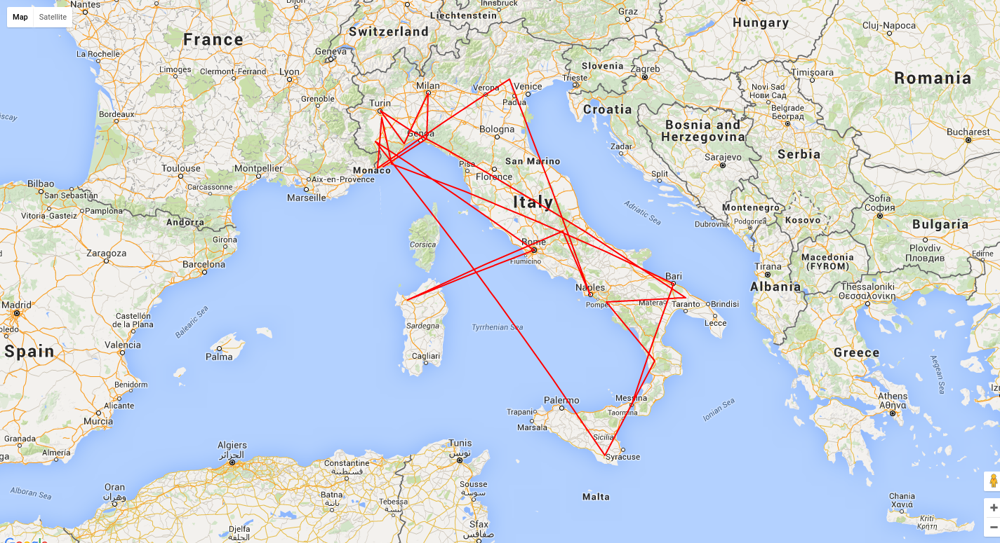

# TSP problem resolved with a <s>Genetic</s> heuristic algorithm

Solve the TSP (Travelling salesman problem) using an <s>Genetic</s> heuristic
algorithm guided by the search for a minimum path

### The selection

The selection uses a gauss distribution (mean: 0 and variance 1) in order to
select over a given population (4 elements by default).

## Prepare your list
```php
<?php
require_once __DIR__ . '/vendor/autoload.php';

use Gen\Plan;
use Gen\Point;
use Gen\Place;
use Gen\Life;

$plan = new Plan();

$plan->addPlace(new Place('sanremo', new Point(43.815967,7.776057)));
$plan->addPlace(new Place('milano', new Point( 45.465422, 9.185924)));
$plan->addPlace(new Place('cuneo', new Point( 44.384477, 7.542671)));
$plan->addPlace(new Place('salerno', new Point( 40.682441, 14.768096)));
$plan->addPlace(new Place('napoli', new Point( 40.851775, 14.268124)));
$plan->addPlace(new Place('roma', new Point( 41.902783, 12.496366)));
$plan->addPlace(new Place('torino', new Point( 45.070312, 7.686856)));
$plan->addPlace(new Place('imperia', new Point( 43.889686, 8.039517)));
$plan->addPlace(new Place('ventimiglia', new Point( 43.791237, 7.607586)));
$plan->addPlace(new Place('sassari', new Point( 40.725927, 8.555683)));

$life = new Life();
$roadmap = $life->getShortestPath($plan);

echo "Distance: {$roadmap->distance()}" . PHP_EOL . PHP_EOL;
foreach ($roadmap->places as $place) {
    echo "Move: {$place->name}" . PHP_EOL;
}
```

The travel:

```sh
Distance: 1422.5814529486

Move: sanremo
Move: ventimiglia
Move: cuneo
Move: torino
Move: milano
Move: imperia
Move: sassari
Move: roma
Move: napoli
Move: salerno
```

## Change the selection

You can change the mutation during the natural selection

```php
$life = new Life(new Selection(10000));
```

## Here is the mess



